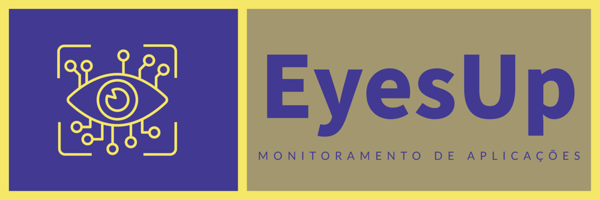
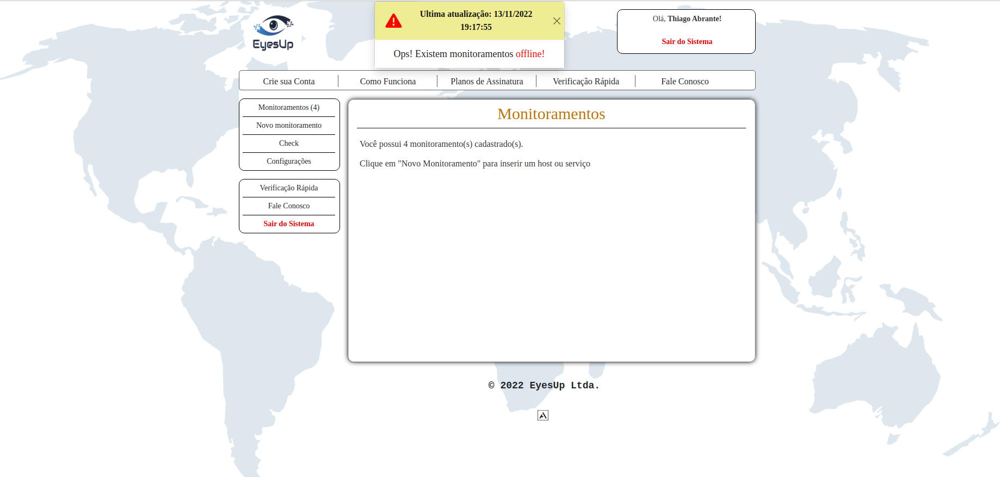
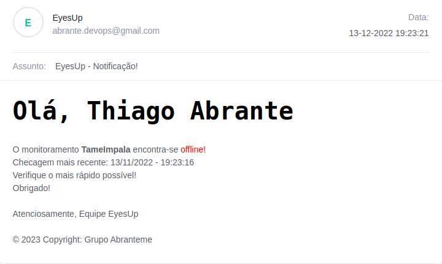
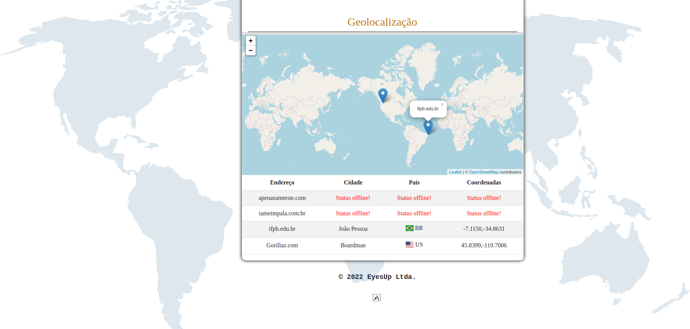
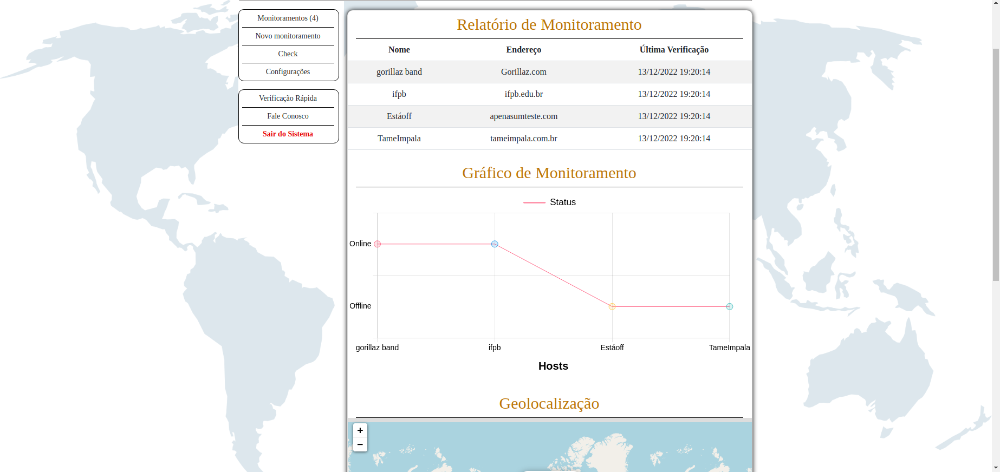
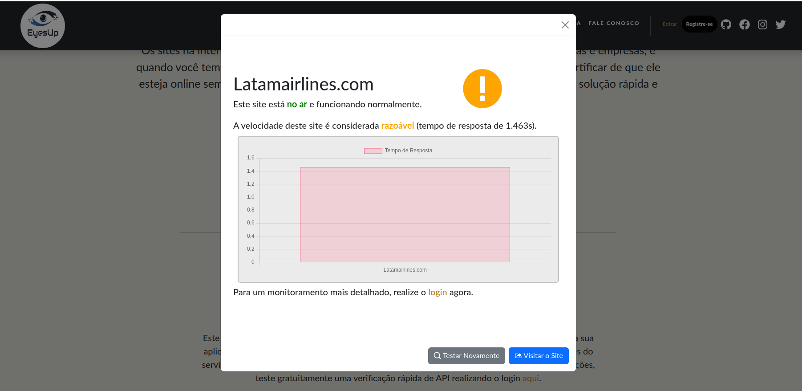
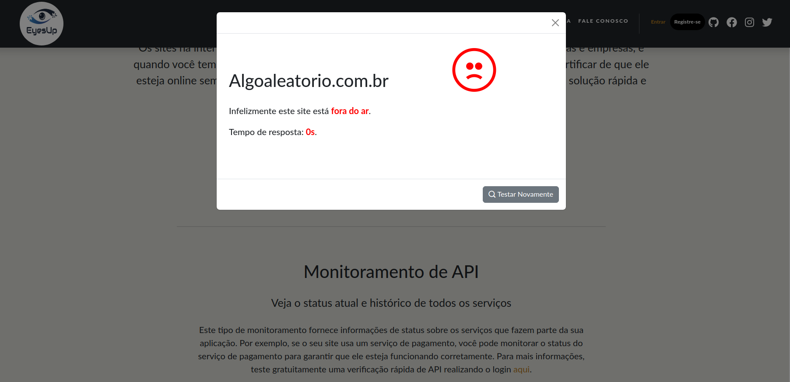
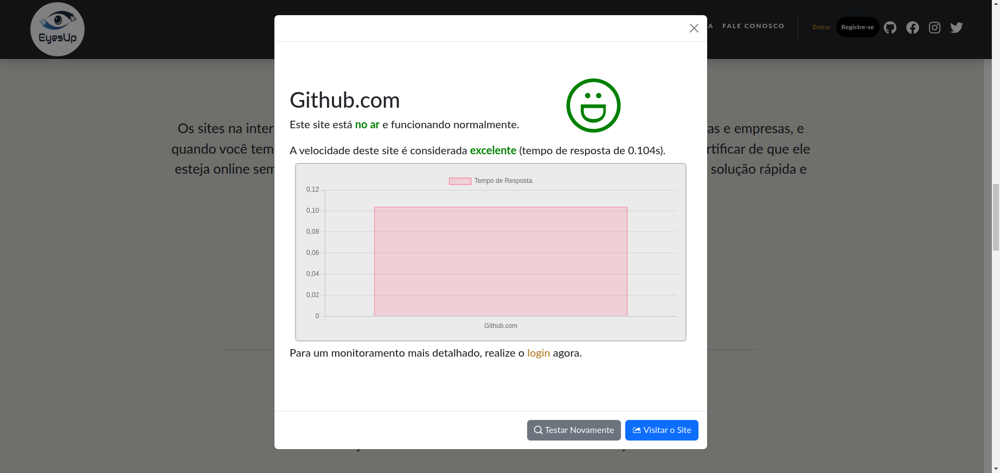

<p align="center"></p>

# :pushpin:  Índice

<p align="center">
  <a href="#sobre-o-projeto">Sobre o projeto</a>&nbsp;&nbsp;&nbsp;|&nbsp;&nbsp;&nbsp;
  <a href="#como-funciona">Como funciona</a>&nbsp;&nbsp;&nbsp;|&nbsp;&nbsp;&nbsp;
  <a href="#funcionalidades-do-projeto">Funcionalidades do projeto</a>&nbsp;&nbsp;&nbsp;|&nbsp;&nbsp;&nbsp;
  <a href="#prints">Prints</a>&nbsp;&nbsp;&nbsp;|&nbsp;&nbsp;&nbsp;
  <a href="#tecnologias-utilizadas">Tecnologias utilizadas</a>&nbsp;&nbsp;&nbsp;|&nbsp;&nbsp;&nbsp;
  <a href="#como-rodar-o-projeto">Como rodar o projeto</a>&nbsp;&nbsp;&nbsp;|&nbsp;&nbsp;&nbsp;
  <a href="#licença">Licença</a>&nbsp;&nbsp;&nbsp;|&nbsp;&nbsp;&nbsp;
  <a href="#contato">Contato</a>
</p>


<h1><a id="sobre-o-projeto"> :bulb:  Sobre o projeto </a></h1>

Esta é uma ideia para o projeto da disciplina de Desenvolvimento WEB do curso de Tecnologia de Redes de Computadores do IFPB - Campus JP. 
A EyesUp nasceu com o intuito de facilitar o monitoramento de aplicações WEB e API's, de forma simples e rápida, para que o usuário possa ter uma visão geral de como está o funcionamento de suas aplicações e assim poder tomar decisões mais rápidas. 

<h1><a id="como-funciona"> :wrench:  Como funciona </a></h1>

O usuário pode cadastrar suas aplicações WEB e API's e assim o sistema irá realizar o monitoramento, ocorrendo algum erro ou aviso, o usuário será notificado em tempo real. O usuário também pode visualizar os gráficos de monitoramento, geolocalização dos servidores e assim ter uma visão geral de como está o desempenho de suas aplicações.

<h1><a id="funcionalidades-do-projeto"> :hammer:  Funcionalidades do projeto </a></h1>


- `Funcionalidade 1`: Monitoramento de Aplicações WEB
- `Funcionalidade 2`: Monitoramento de API
- `Funcionalidade 3`: GeoLocalização dos Servidores
- `Funcionalidade 4`: Notificações em tempo real de Erros e Avisos
- `Funcionalidade 5`: Gráficos de Monitoramento
- `Funcionalidade 6`: Verificações rápidas com retorno de status e tempo de resposta da aplicação WEB

<h1><a id="prints"> :camera:  Prints </a></h1>


<p align="center"></p>
<p align="center"></p>
<p align="center"></p>
<p align="center"></p>
<p align="center"></p>
<p align="center"></p>
<p align="center"></p>
<p align="center"></p>

<h1><a id="tecnologias-utilizadas"> :rocket:  Tecnologias utilizadas </a></h1>


- `HTML`
- `CSS`
- `JavaScript`
- `Bootstrap`
- `Chart.js`
- `Leaflet.js`
- `Node.js`
- `Express`
- `Prisma`
- `JWT`
- `BCrypt`
- `sqlite3`

<h1><a id="como-rodar-o-projeto"> :computer:  Como rodar o projeto</a></h1>


```bash
# Clone este repositório
$ git clone https://github.com/abrantedevops/Project_API_DW

# Acesse a pasta do projeto no terminal
$ cd Project_API_DW

# Instale as dependências
$ npm i

# Crie um arquivo .env na raiz do projeto e adicione as seguintes variáveis de ambiente
# JWT
$ SECRET=secret_anything

# BCRYPT
$ SALT=10

# Prisma
DATABASE_URL="file:./dev.db"

# Nodemailer
$ EMAIL=your_email
$ PASSWORD=your_password

# PS: Para o envio das notificações via email, alterar as constantes "user" "pass" no arquivo notifyController.js (linhas 9, 10 e 20) para as variáveis de ambiente EMAIL e PASSWORD

# Execute a aplicação em modo de desenvolvimento
$ npm run dev

# O servidor inciará na porta:3000 - acesse http://localhost:3000
```
<h1><a id="licença"> :pencil:  Licença</a></h1>


MIT License

Copyright (c) 2012-2022 Thiago Abrante de Souza

Permission is hereby granted, free of charge, to any person obtaining
a copy of this software and associated documentation files (the
"Software"), to deal in the Software without restriction, including
without limitation the rights to use, copy, modify, merge, publish,
distribute, sublicense, and/or sell copies of the Software, and to
permit persons to whom the Software is furnished to do so, subject to
the following conditions:

The above copyright notice and this permission notice shall be
included in all copies or substantial portions of the Software.

THE SOFTWARE IS PROVIDED "AS IS", WITHOUT WARRANTY OF ANY KIND,
EXPRESS OR IMPLIED, INCLUDING BUT NOT LIMITED TO THE WARRANTIES OF
MERCHANTABILITY, FITNESS FOR A PARTICULAR PURPOSE AND
NONINFRINGEMENT. IN NO EVENT SHALL THE AUTHORS OR COPYRIGHT HOLDERS BE
LIABLE FOR ANY CLAIM, DAMAGES OR OTHER LIABILITY, WHETHER IN AN ACTION
OF CONTRACT, TORT OR OTHERWISE, ARISING FROM, OUT OF OR IN CONNECTION
WITH THE SOFTWARE OR THE USE OR OTHER DEALINGS IN THE SOFTWARE.

<h1><a id="contato"> :iphone:  Contato</a></h1>


- [Thiago A. Souza](mailto:thiago.abrante@academico.ifpb.edu.br)
- [Larissa Galdino](mailto:larissa.galdino@academico.ifpb.edu.br)
- [Matheus Gomes](mailto:gomes.andrade@academico.ifpb.edu.br)


